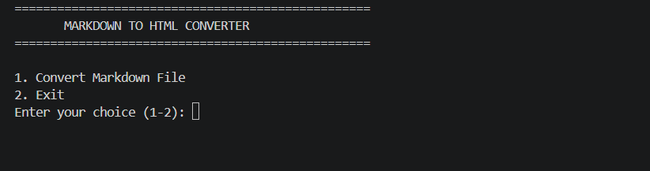
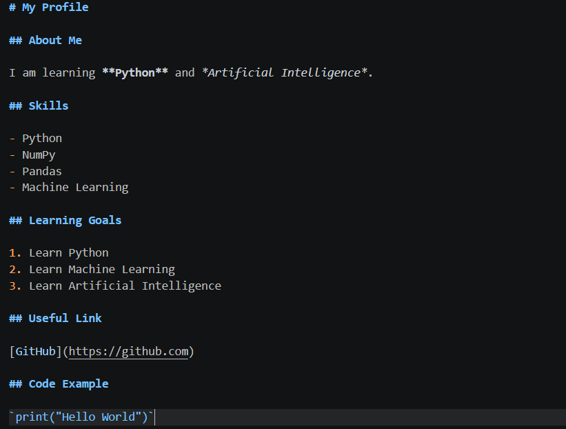
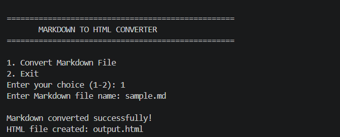
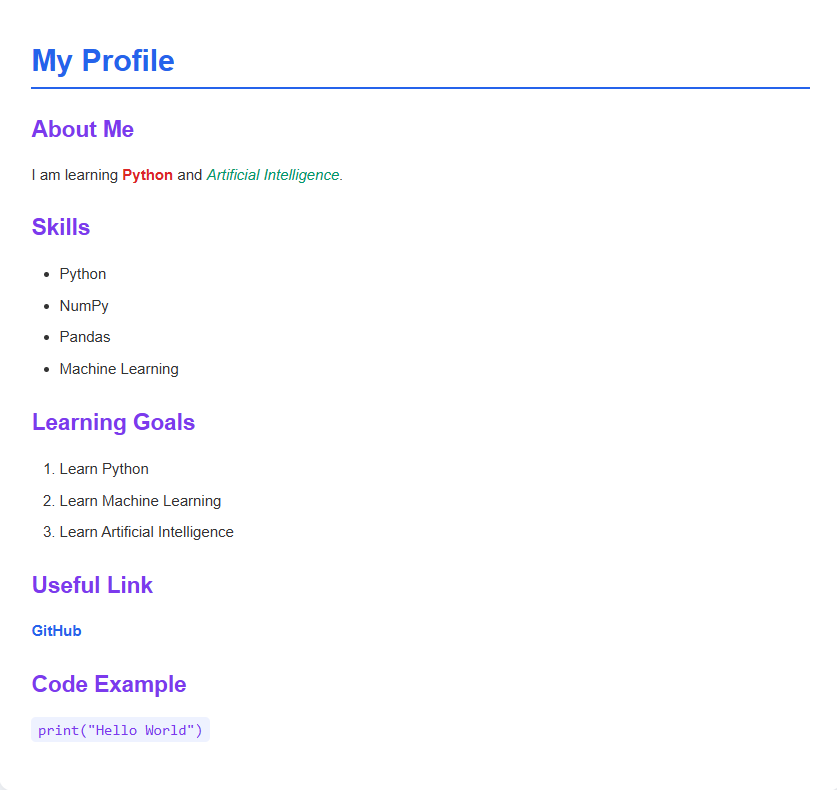

# Markdown to HTML Converter

## Project Details

**Intern ID:** Your Intern ID  
**Name:** Your Name  
**Duration:** 4 Weeks  

## Project Scope

Markdown to HTML Converter is a Python-based application used to convert Markdown files into HTML files. The project reads Markdown content from a file, converts common Markdown elements into HTML tags, and generates a complete HTML webpage with CSS styling.

## Features

- Convert Markdown files into HTML
- Convert headings into HTML headings
- Convert bold and italic text
- Convert unordered lists
- Convert ordered lists
- Convert links
- Convert inline code
- Convert code blocks
- Generate a complete HTML document
- Apply CSS styling to the generated webpage
- Save the converted output as an HTML file
- Handle invalid file names and file errors
- Menu-driven command-line interface

## Technologies Used

- Python
- Regular Expressions
- HTML
- CSS
- File Handling
- Exception Handling
- Functions

## Project Files

- `main.py` - Main application code
- `sample.md` - Sample Markdown input file
- `output.html` - Converted HTML output file
- `README.md` - Project documentation
- `menu.png` - Main menu screenshot
- `markdown_input.png` - Markdown input screenshot
- `conversion.png` - Conversion success screenshot
- `html_output.png` - Final HTML output screenshot

## How to Run

1. Install Python.
2. Open the project folder in the terminal.
3. Run the following command:

```bash
python main.py
```
## Output Screenshots

### Main Menu



### Markdown Input



### Conversion Success



### HTML Output

